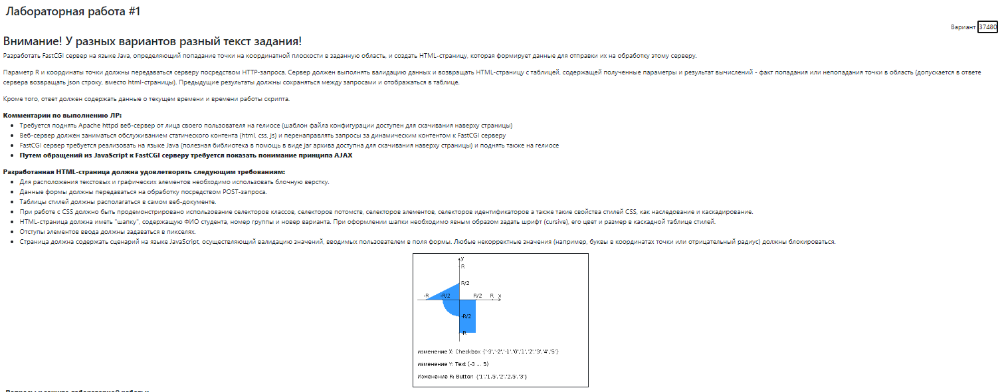

# Build docker image (optional)
```
bash docker/build.bash
```
# How to start HTTPD Server?
```
bash docker/run.bash
```
# Open another terminal in HTTPD Server
```
bash docker/into.bash
```
# To stop HTTPD Server
```
bash docker/stop.bash
```
# To connect to website via browser
```
http://localhost:8080/
```
# To run fast-cgi process 
```
java -jar -DFCGI_PORT=20031 fcgi-bin/server-1.0-jar-with-dependencies.jar
```